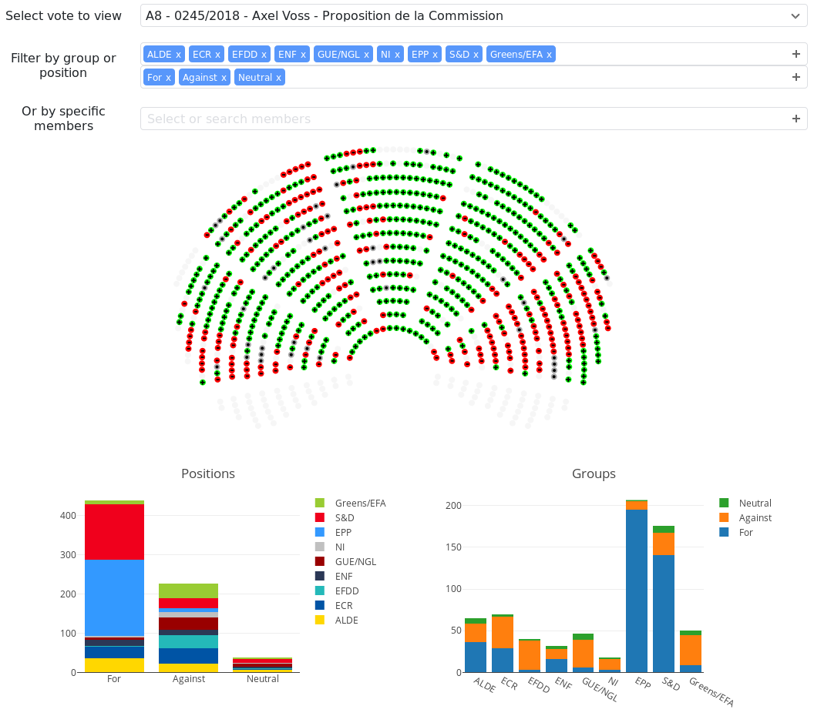

# Interactive visualization of EU parliament vote on Copyright reform 

On the 5th of July 2018, the European Parliament had to decide whether to confirm the Committee position on controversial Articles 11 and 13 of the proposal.

This website offers an interactive visualization of the vote.

A live version of this site is available at [https://jorquera.net/euparlvote/](https://jorquera.net/euparlvote/).

